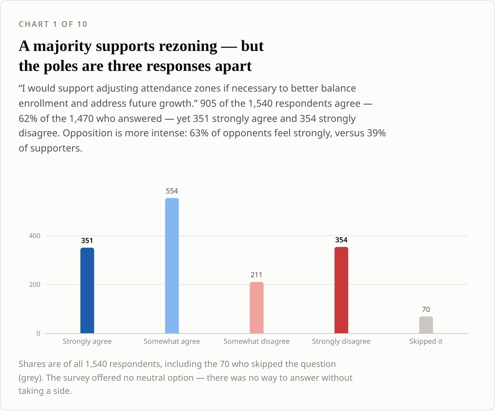
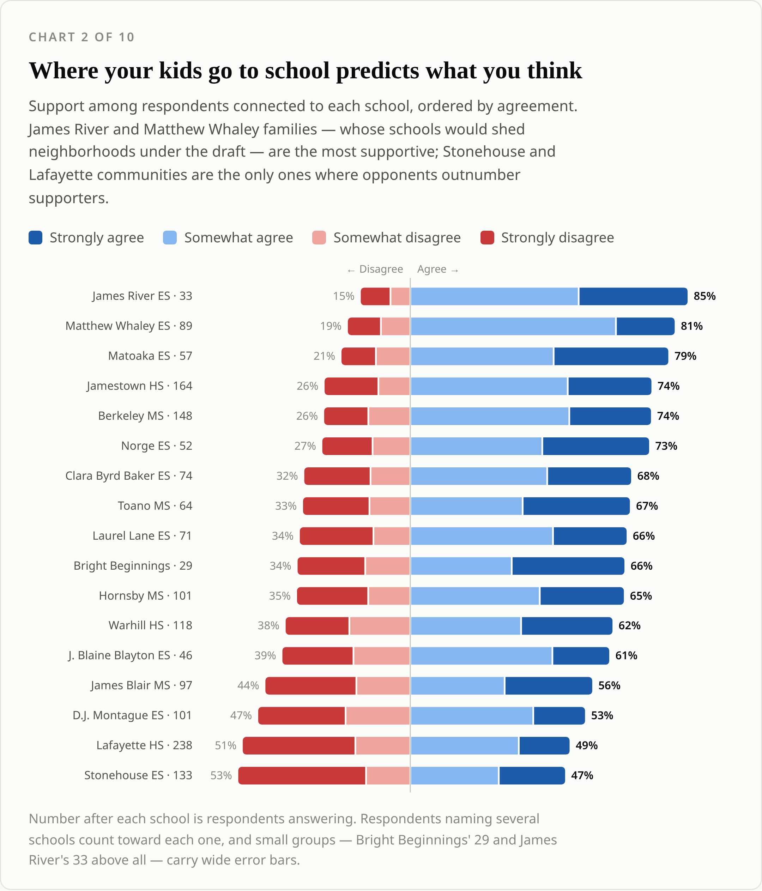
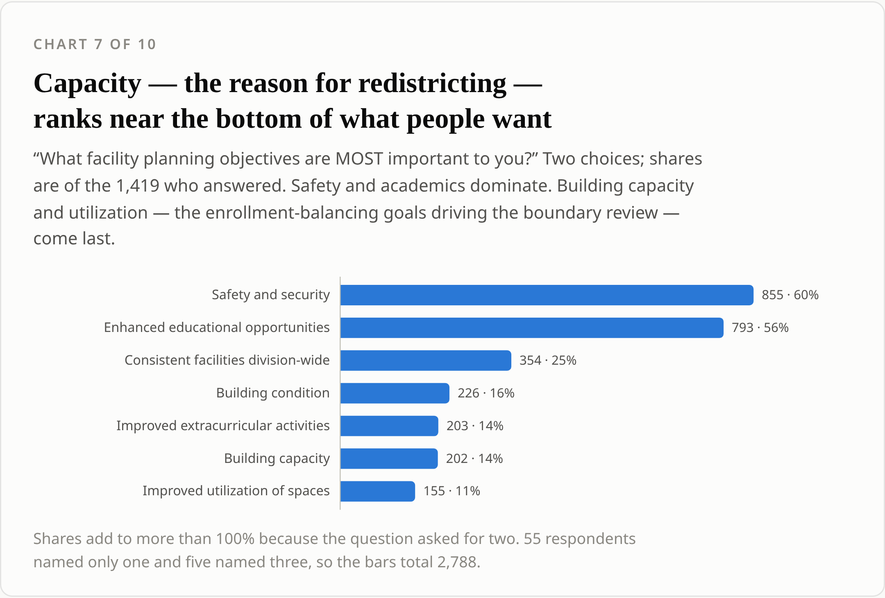

<!--
DRAFT — Substack version. Charts 1, 2, 7 only, as static PNGs from site/substack/.
Substack strips JavaScript, so nothing here is interactive: no hover, no click-a-bar,
no embedded explorer. Upload the three PNGs into the post editor; the paths below are
placeholders for wherever Substack rehosts them.
Replace BLOG_URL with the post URL once the Astro site is live.
-->

# The redistricting survey said yes. It also ranked the reason for redistricting dead last.

## What 1,540 responses to the WJCC boundary survey actually say

---

The division published the raw results of its redistricting survey in early July: 3,106 pages of redacted PDF, one respondent after another, no summary. It is the complete record of what the community told the board, and it is effectively unreadable.

I parsed the whole thing. Three charts below, then the part I'd most like you to do yourself.

The short version: a majority of respondents said they'd support adjusting attendance zones. The same respondents, asked separately what they actually want from facility planning, ranked **building capacity sixth out of seven and utilization of spaces seventh** — the two goals that constitute the entire case for redistricting. And the boundary priority they ranked first, by a mile, was "keep neighborhoods together," which is the exact objection people are bringing to the draft maps.

That's a community that will accept redistricting in principle and rejects nearly every specific reason given for it.

---

### A majority supports rezoning — and the poles are three responses apart

905 agree, 565 disagree — **62% of the 1,470 people who answered.** (Seventy skipped it, so that's 62% of answerers, not of all 1,540.) That's the number the division will lead with, and it's real.

Now look at the ends. **351 strongly agree. 354 strongly disagree.** The committed wings are three responses apart, and the whole majority sits in the soft middle.

There's a second asymmetry underneath that one. **63% of the people who oppose this feel strongly. Only 39% of supporters do.** The opposition is smaller and considerably harder. If you've sat through a board meeting and wondered why the room sounds nothing like a 62% majority — that's why. The room is the 354.

Worth noting: the survey offered no neutral option. Agree somewhat, agree strongly, disagree somewhat, disagree strongly. There was no way to answer without picking a side.

### Where your kids go to school predicts what you think

**James River Elementary families support the plan 85%. Matthew Whaley, 81%.** Both are schools that would shed neighborhoods under the draft — where redistricting means relief.

**Stonehouse Elementary (47%) and Lafayette High (49%) are the only two communities in the survey where opponents outnumber supporters.** Lafayette is also the largest single group in the data, at 238 respondents.

The ordering tracks the draft maps closely enough that you could nearly redraw them from this chart. Small groups here — Bright Beginnings' 29 respondents, James River's 33 — carry wide error bars, so don't over-read a few points between neighbors. Do read the thirty-eight-point spread from top to bottom.

### Capacity — the reason for redistricting — ranks near the bottom of what people want

Asked which facility planning objectives matter most — two picks, 1,419 answering — respondents chose **safety and security (60%)** and **enhanced educational opportunities (56%)**. Nothing else is close.

**Building capacity: 14%. Improved utilization of spaces: 11%.** Sixth and seventh out of seven.

This doesn't mean WJCC has no capacity problem; enrollment projections are a fact about buildings, and a community can be wrong about what it needs. It means that if the case for new boundaries is built on capacity and utilization, it's being argued from the two objectives the division's own respondents ranked last.

---

### The part I'd rather you did yourself

More than a quarter of respondents — **416 people, 27%** — raised class, diversity, equity or segregation in the open comments, in a survey that never asked about any of them. That's the largest unprompted theme in the data.

I could tell you what those comments say. I'd rather not: summarizing a thousand people's words into a paragraph is exactly the move that makes this kind of analysis untrustworthy, and you have no way to check me.

So instead — **[search the comments yourself](https://claude.ai/code/artifact/b4a10686-be66-4bb9-b564-f74c870eea6d).** Every open-text answer from all 1,540 respondents, searchable, filterable by school and role, downloadable as a spreadsheet. Every count I publish is a plain word search you can retype to get the same number back. When I say 261 people wrote "divers," you can type `divers` and see all 261.

> ⚠️ **Replace `BLOG_URL` in the link below before publishing, then delete this line.**

**[The full ten-chart version and the longer write-up are here →](BLOG_URL)** — including how the late June surge nearly reversed the result, why staff back the plan four-to-one, and which neighborhoods dominate the comments.

---

*Method: figures are script-parsed from* Redistricting Survey Raw Results — Final *(WJCC Schools / MGT, June 2026), 3,106 pages. One warning if you check my work: the PDF's embedded font maps `f`, `ff`, `fi` and `fl` to unused codepoints, so every text extractor silently deletes them — "La ayette" for "Lafayette." Those glyphs were repaired before anything was counted, and if your extraction disagrees with my numbers, that's almost certainly why. The export also duplicates each comment across the elementary/middle/high questions in 1,539 of 1,540 records, so comment counts here are per respondent, not per school level. This is a self-selected feedback survey, not a random-sample poll: it measures who showed up. Full methodology in the long version.*
